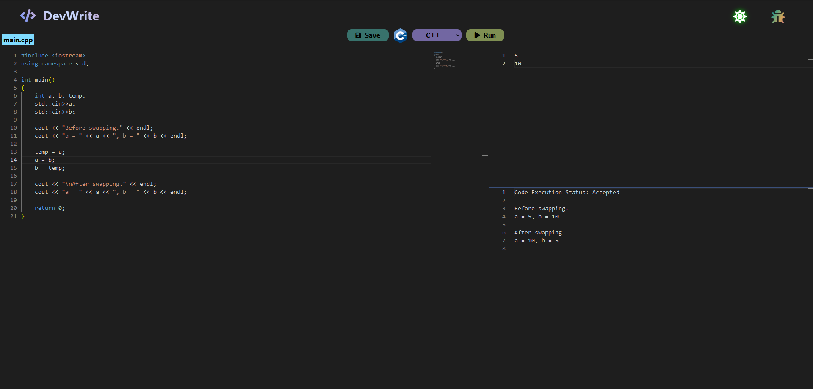

# Getting Started with DevWrite

  <!--  -->
  

## A Lightweight and Customizable React Code Editor

This project is a React-based code editor that provides a user-friendly interface for writing and editing code. It offers several key features:

#### Line numbers
#### Code linting (error and warning detection)
#### Autocompletion
#### Theme switching (light/dark mode)
#### Language Selection

## Available Scripts

In the project directory, you can run:

### `npm start`
or using docker:
### `docker run -d -p 3000:3000 devwrite`
Runs the app in the development mode.\
Open [http://localhost:3000](http://localhost:3000) to view it in your browser.

The page will reload when you make changes.\
You may also see any lint errors in the console.

## Learn More

To learn React, check out the [React documentation](https://reactjs.org/).